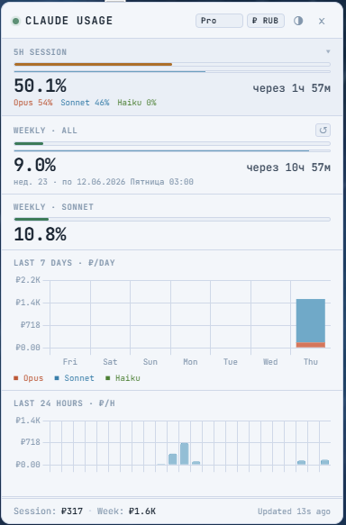

# Claude Usage Overlay



Always-on-top Electron widget for monitoring Claude Code token usage on the **Max 5×** plan.

## Features

- Real-time 5-hour session window with per-model breakdown
- Weekly totals (all models + Sonnet-only)
- Last 7 days stacked bar chart (Opus / Sonnet / Haiku)
- Last 60-minute token sparkline
- USD cost estimates
- Transparent frameless window, always on top, skip taskbar
- System tray icon
- Global hotkey **Ctrl+Shift+U** (show/hide)
- Window position saved across restarts

## Run

```
npm install
npm start
```

## Logs location

Parser scans `%USERPROFILE%\.claude\projects\**\*.jsonl` recursively.  
If the directory is empty — Claude Code hasn't been used yet, or stores logs elsewhere.  
Check: `claude config get` to see the configured data dir.

## Tune limits (other plans)

Edit `LIMITS` in `main.js`:

```js
// Max 5x (default)
const LIMITS = { session5h: 88_000_000, weeklyAll: 2_400_000_000, weeklySonnet: 1_800_000_000 };

// Max 20x
const LIMITS = { session5h: 352_000_000, weeklyAll: 9_600_000_000, weeklySonnet: 7_200_000_000 };

// Pro (approx.)
const LIMITS = { session5h: 8_800_000, weeklyAll: 240_000_000, weeklySonnet: 180_000_000 };
```

## Keyboard shortcut

**Ctrl+Shift+U** — global, works even when the window is hidden or unfocused.

## Troubleshooting

| Symptom | Fix |
|---------|-----|
| Window doesn't appear | Check system tray, press Ctrl+Shift+U |
| All zeros | Run `node test-parser.js` to verify log files are found |
| `~/.claude/projects` empty | Claude Code not yet used, or run `claude config get` to find the actual log dir |
| Graphs look wrong | Open DevTools via tray → `electron .` in terminal, check console errors |

## Dev

```
node test-parser.js   # test log parsing without starting Electron
npm start             # launch the overlay
```

---

# Claude Usage Overlay (Русский)

Оверлей-виджет на базе Electron, работающий поверх всех окон, для мониторинга использования токенов Claude Code.

## Возможности

- Отображение лимитов 5-часовой сессии в реальном времени с разбивкой по моделям
- Недельные итоги (все модели + отдельно Sonnet)
- График за последние 7 дней (Opus / Sonnet / Haiku)
- График затрат за последние 24 часа
- Оценка стоимости в долларах (USD) и рублях (RUB)
- Режим "Ghost Mode": полупрозрачность и пропускание кликов мыши насквозь (не мешает работе)
- Прозрачное окно без рамок, работающее поверх всех окон, скрыто из панели задач
- Иконка в системном трее
- Сохранение позиции окна при перезапусках
- Поддержка WSL (автоматический поиск логов в локальной Windows и Ubuntu WSL)

## Горячие клавиши

**Ctrl+Shift+U** — показать/скрыть виджет (работает глобально).
**Ctrl+Alt+U** — включить/выключить режим "Ghost Mode" (прозрачность и клики насквозь).

## Запуск

```
npm install
npm start
```
(Или используйте файл `start-widget.bat` для быстрого запуска без окна консоли)

## Где виджет берет логи

Парсер автоматически сканирует `%USERPROFILE%\.claude\projects\**\*.jsonl` (а также `\\wsl$\Ubuntu\home\...`).  
Если виджет везде показывает нули, убедитесь, что вы уже пользовались Claude Code, или проверьте, где лежат логи командой `claude config get`.

